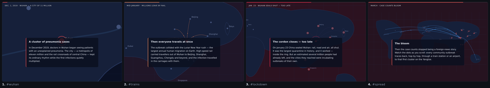

# scrolly

**The scrollytelling framework.** You write the DOM, scrolly runs the state
machine, effects live in your CSS.

Drop in one script tag and one stylesheet, mark up your story as sections,
and scrolly turns scroll position into classes, attributes, and CSS custom
properties. It never sets a visual property itself — your CSS does every
effect. 4.5 KB gzipped, zero dependencies, no build step, runs from
`file://`.

> **Status: pre-1.0 (v0.0.1), not yet published to npm.** The contract below
> is stable and covered by tests. Until the first publish, install by
> vendoring the two files (see [Install](#install)).

## Demo



One story, four scroll positions — the camera pulling back as the reader
scrolls. Nothing in it is scripted: the camera moves because each step
carries a `data-focus`, the cards and colours change because CSS reacts to
`[data-active-step]`, and the only JavaScript on the page is
`Scrolly.init()`.

Every example is a single self-contained HTML file you can open straight from
disk — no server, no build:

| | |
|---|---|
| [`index.html`](index.html) | the tour: layouts, crossfades, progress, themes |
| [`examples/virus-got-out.html`](examples/virus-got-out.html) | camera flights over a map, scrubbed particle flows — zero author JS |
| [`examples/zoom-tour.html`](examples/zoom-tour.html) | a nine-shot zoom tour of a decision tree, camera and scrub in the same chapters |

Full list in the [Gallery](#gallery).

## Install

**Vendor the files.** Copy `dist/scrolly.min.js` and `dist/scrolly.css` next
to your page and reference them directly. This is the intended path: the
library is small enough to commit, and pages stay openable from `file://`.

```html
<link rel="stylesheet" href="scrolly.css">
<script src="scrolly.min.js"></script>
```

**Or clone and build.** `dist/` is committed, so this is only needed if you
change `src/`:

```sh
git clone https://github.com/sixthshift/scrolly-js.git
cd scrolly-js && bun install && bun run build
```

See [CONTRIBUTING.md](CONTRIBUTING.md).

**npm** — the package is `scrolly-js`, not published yet (tracked in
[Roadmap](#roadmap)). The manifest is ready, so this works unchanged on the
day it ships:

```js
import Scrolly from 'scrolly-js'   // dist/scrolly.esm.js, types included
```

The package name carries a `-js` suffix because plain `scrolly` on npm
belongs to an unrelated 2014 scrollbar plugin. Nothing you write changes:
the class is `.scrolly`, the global is `Scrolly`, the events are
`scrolly:stepenter` and friends — same split reveal.js uses.

What's in `dist/`:

| File | |
|---|---|
| `scrolly.min.js` | classic `<script>`, sets `window.Scrolly` — the canonical artifact |
| `scrolly.css` | structural stylesheet (pinning, layouts, mobile collapse) |
| `scrolly.esm.js` | ES module, no global side effect |
| `scrolly.d.ts` | TypeScript types |

## Quick start

```html
<link rel="stylesheet" href="scrolly.css">

<article class="scrolly" data-layout="side-right">
  <figure>
    
    
  </figure>
  <section class="step" id="intro">…prose…</section>
  <section class="step" id="crash">…prose…</section>
  <section class="step" id="recovery">…prose…</section>
</article>

<script src="scrolly.min.js"></script>
<script>Scrolly.init()</script>
```

The `<figure>` pins to the viewport; the steps scroll past it. As each step
crosses the trigger line, scrolly updates the state below and your CSS does
the rest.

## The contract

Everything scrolly does is expressed as state your CSS can react to:

| Surface | What it carries |
|---|---|
| `.step` classes | `is-past` / `is-active` / `is-future` |
| `.scrolly[data-active-step="id"]` | lets any selector on the page react to any step |
| `[data-show="id …"]` graphic children | `is-shown` while a listed step is active (crossfade by default) |
| `--step-progress` / `--story-progress` | 0 → 1 through the active chapter / the whole story |
| `--progress-<id>` | per-chapter progress that never resets — the scrub timeline |
| `--camera-transform` | the current camera shot, interpolated between focused steps |

That is the whole mental model. The full reference — every attribute, the
`data-show` range syntax, the declarative motion layer
(`data-scrub`/`data-camera`/`data-focus`/`data-morph`), and the JS API for
imperative graphics — is in **[docs/api.md](docs/api.md)**.

Referential mistakes never break the page: a token matching nothing fails
soft and logs one `scrolly:`-prefixed warning.

## Recipes

The full set lives in [docs/recipes.md](docs/recipes.md). These two are whole
stories rather than fragments — paste either into a page that already loads
`scrolly.css` and `scrolly.min.js` and it runs — and each ships as a live
fixture (`e2e/fixtures-clean/recipe-*.html`) the e2e suite scrolls end to
end, so a recipe that stops working cannot stay published.

### A photo as the camera stage

A raster gives a selector nothing to point at, which is what raw-coordinate
`data-focus` is for: each shot names a box of the image itself.

```html
<article class="scrolly" data-layout="side-right">
  <figure>
    <svg viewBox="0 0 320 200" width="100%" height="100%">
      <g data-camera>
        <image width="320" height="200" href="data:image/png;base64,iVBORw0KGgoAAAANSUhEUgAAACAAAAAUCAMAAADbT899AAAAElBMVEUbT3I2faNOejptnE7PybizRS+ryHFxAAAAYUlEQVR42sWOSQ7AMAgDATv//3LVKguoFuqtXBwxI2KzP4eflr5fYwjf/S14nTjHmTAXjirMXZksCFyEhQFgZhKcrHzFbk1KvoUgA4LDTh3JjwDNw+THKQw9fy50/O7QclzLewORR14f8wAAAABJRU5ErkJggg=="/>
      </g>
    </svg>
  </figure>
  <section class="step" id="coast" data-focus="0 0 320 200" data-shot="wide"><p>The whole coast.</p></section>
  <section class="step" id="jetty" data-focus="60 40 80 110" data-shot="medium"><p>Down to the jetty.</p></section>
  <section class="step" id="hut" data-focus="70 40 40 40" data-shot="close"><p>The hut at its end.</p></section>
</article>
```

That `data:` URI is a 32×20 stand-in — swap in your own `photo.jpg`. The stage
has to be SVG: the camera composes its transform in the graphic's own
coordinate space, and a bare `` has none. The boxes are read in that same
space, so `0 0 320 200` is the whole `viewBox`.

### Scrubbing one chapter

```html
<style>
  .dial { width: 300px; height: 40px; background: #dde3ee }
  .needle { width: 6px; height: 40px; background: crimson }
  .needle[data-scrub] { animation-name: sweep }
  @keyframes sweep { from { transform: translateX(0) } to { transform: translateX(294px) } }
</style>
<article class="scrolly" data-layout="side-right">
  <figure>
    <div class="dial"><div class="needle" data-scrub="rising"></div></div>
  </figure>
  <section class="step" id="calm"><p>The needle waits at 0%.</p></section>
  <section class="step" id="rising"><p>Through this chapter it tracks your scroll.</p></section>
  <section class="step" id="after"><p>Arrived — and it rewinds if you scroll back up.</p></section>
</article>
```

You own `animation-name` and nothing else: scrolly stamps `--t` from
`var(--progress-rising)` and normalizes the duration, so the `@keyframes` are
the whole timeline. Drop the value — plain `data-scrub` — to scrub against
`--story-progress` instead of one chapter.

## Gallery

Each example is a self-contained `file://`-openable page. "Zero author JS"
means the only script on the page is `Scrolly.init()` — everything moving is
CSS reacting to scrolly's state, verified by
`scripts/validate-story.mjs --tier1`, which drives every chapter forward, in
reverse, and out of order and checks that a chapter frames the same graphic
whichever way the reader reached it.

| Example | What it demonstrates |
|---|---|
| [`warming-world.html`](examples/warming-world.html) | Stepped line-chart build: six warming factors added one at a time. Zero author JS. |
| [`stepped-scatter.html`](examples/stepped-scatter.html) | Sticky scatter with stepped cohort highlighting and long prose gaps between steps. Zero author JS. |
| [`scroll-linked.html`](examples/scroll-linked.html) | A classifier's boundary rotating and its points drifting — pure `@keyframes` scrubbed by `data-scrub`. Zero author JS. |
| [`virus-got-out.html`](examples/virus-got-out.html) | Camera flights, `offset-path` particle flows, a scroll-linked bloom, chapter theming. Zero author JS. |
| [`zoom-tour.html`](examples/zoom-tour.html) | Nine camera flights across one large stage while scrubbed elements move in the same chapters. Zero author JS. |
| [`dots-flow.html`](examples/dots-flow.html) | Particles regrouping per step, each travelling via `data-morph` + `view-transition-name`. Uses `stepenter`. |
| [`longform.html`](examples/longform.html) | Three independent stories on one page, mixing all three layouts. |

## Themes

Typography and color presets, opt-in, loaded after `scrolly.css`:

```html
<link rel="stylesheet" href="scrolly.css">
<link rel="stylesheet" href="themes/editorial.css">
```

- [`themes/editorial.css`](themes/editorial.css) — warm serif (Georgia/Iowan Old Style).
- [`themes/system.css`](themes/system.css) — tight neutral `system-ui`.

Themes only set typography, color, and the `--scrolly-card-bg` /
`--scrolly-card-fg` knobs — never geometry. Write your own if neither fits;
the contract is the classes and custom properties, not these files.

## Browser support

Any browser with `IntersectionObserver` and CSS custom properties — every
current release of Chrome, Safari, Firefox, and Edge. Two things degrade
rather than break:

- **`data-morph`** needs the View Transitions API. Without it the step change
  still happens, just without the transition.
- **`prefers-reduced-motion: reduce`** turns every scrub and camera flight
  into a cut at the chapter midpoint, and skips morphs entirely.

A page whose JavaScript never runs stays fully readable — all hiding CSS is
scoped under `.scrolly.is-ready`, which the runtime stamps last.

Keyboard: `←`/`→` step between chapters while a story is on screen (smooth,
reduced-motion aware). Vertical scroll keys are never touched.

## Authoring tools

Neither costs the library a byte:

- [`scrolly-director.js`](scrolly-director.js) — the viewfinder. Load it like
  a theme with one extra script tag while you author, press `d`, and it draws
  the trigger line, a clickable chapter rail, and a live chip of the state
  your CSS is reacting to.
- `node scripts/validate-story.mjs page.html --report out.html` — drives your
  story forward, in reverse, and out of order in a real browser, then writes
  a storyboard: one row per chapter, the forward frame beside the reverse
  frame, so every continuity verdict comes with the two pictures behind it.

## Docs

| | |
|---|---|
| [docs/api.md](docs/api.md) | full reference — every attribute, variable, and event |
| [docs/recipes.md](docs/recipes.md) | "does scrolly do X?" — progress bars, maps, video scrub, D3 builds |
| [docs/philosophy.md](docs/philosophy.md) | why it's shaped this way, and what it deliberately isn't |
| [ARCHITECTURE.md](ARCHITECTURE.md) | how the repo implements it |
| [SPEC.md](SPEC.md) | the normative contract |
| [CONTRIBUTING.md](CONTRIBUTING.md) | setup, scripts, the rules that matter |

## Roadmap

- first npm publish as `scrolly-js`, plus jsdelivr/unpkg
- `full` layout variant

## License

[MIT](LICENSE) © Jason Huang
